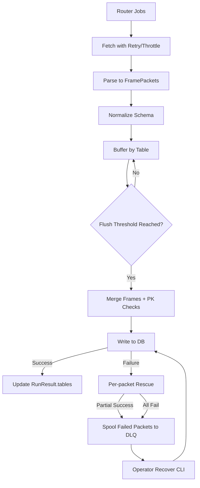
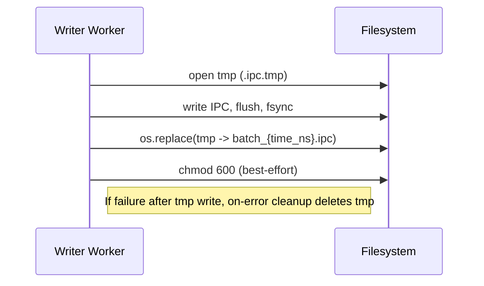

# Data Storage & Management Flow

## Overview

- The pipeline fetches raw data over HTTP, parses into structured packets, normalizes schemas, buffers for efficient bulk writes, and persists to a user-connected database (DuckDB by default).
- Failures during batch writes are handled via a Dead Letter Queue (DLQ) with Arrow IPC artifacts and a per-packet rescue path to maximize successful persistence.
- Observability includes structured logs, counters, histograms, and a summary; data-loss prevention policies ensure that failed data is retained and recoverable.

## Request → Parse

- Jobs are generated by the Router and scheduled in a priority queue.
- Each job goes through rate limiting and retry (with exponential backoff) before HTTP execution.
- The response bytes are parsed into FramePackets by the provider-specific Router.
- Code references:
  - Pipeline orchestration: [pipeline.py:run](packages/vertex-forager/src/vertex_forager/core/pipeline.py)
  - Retry and throttle: [pipeline.py:_fetch_with_retry](packages/vertex-forager/src/vertex_forager/core/pipeline.py)

## Normalize

- The Mapper enforces target schema: column presence, types, and provider-specific transformations.
- Normalized FramePackets advance to the writer queue.
- Code reference: [pipeline.py:normalize in run](packages/vertex-forager/src/vertex_forager/core/pipeline.py)

## Buffer & Flush

- Writer worker maintains per-table buffers for adaptive batching.
- When buffer row-count reaches the flush threshold, frames are merged:
  - Vertical concat with rechunk; diagonal concat fallback for flexible schemas.
  - Primary key enforcement: missing or null PK columns raise errors before writing.
- Code reference: [pipeline.py:_writer_worker flush](packages/vertex-forager/src/vertex_forager/core/pipeline.py)

## Persist to DB

- DuckDBWriter performs transactional upserts, returning WriteResult per packet/bulk.
- Stateless write per packet; bulk write returns one result per input packet.
- Code references:
  - [duckdb.py:write](packages/vertex-forager/src/vertex_forager/writers/duckdb.py)
  - [duckdb.py:write_bulk](packages/vertex-forager/src/vertex_forager/writers/duckdb.py)

## Failure Handling: DLQ + Rescue

- If flush fails, the pipeline:
  - Attempts per-packet writes to salvage healthy packets.
  - Spools only failed packets to DLQ as Arrow IPC.
  - Records errors with context and structured logs.
- DLQ IPC is written atomically:
  - Write to a temp file in the same directory, fsync, then `os.replace` to final path.
  - File permissions are restricted (chmod 600) when possible.
- Consecutive failure threshold:
  - Stops rescue after N consecutive failures and records a summary for remaining packets.
- Code reference: [pipeline.py:_spool_to_dlq_and_rescue](packages/vertex-forager/src/vertex_forager/core/pipeline.py)

## DLQ Layout

- Base: `$VERTEXFORAGER_ROOT/cache/dlq/{table}/`
- Artifact: `batch_{time_ns}.ipc`
- Contents: Polars DataFrame representing failed packets merged for that table.
- Read with `pl.read_ipc(path)` to reinject or analyze.

## Observability

- Structured logs with key-value formatting and stages:
  - `http_start`, `http_retry_reason:*`, `http_end`
  - `write_flush`, `dlq_spooled`, `dlq_rescued_{n}`, `dlq_remaining_{n}`
- Counters and histograms tracked for durations and rows:
  - `fetch_duration_s`, `parse_duration_s`, `http_duration_s`, `writer_flush_duration_s`
  - `rows_written_total`, `errors_total`
- Code references:
  - Log helper: [pipeline.py:_log_structured](packages/vertex-forager/src/vertex_forager/core/pipeline.py)
  - Summary: [pipeline.py:metrics summary](packages/vertex-forager/src/vertex_forager/core/pipeline.py)

## Cleanup & Retention

- Temp files `.ipc.tmp` are removed in two ways:
  - On-error cleanup: when DLQ spool fails after writing temp, the temp is deleted before recording `DLQSpoolError`.
  - Periodic cleanup: at run start, stale temp files older than retention are removed.
- Configuration:
  - `EngineConfig.dlq_tmp_cleanup_on_error` (default True)
  - `EngineConfig.dlq_tmp_periodic_cleanup` (default True)
  - `EngineConfig.dlq_tmp_retention_s` (default 86400)
- Code references:
  - On-error cleanup: [pipeline.py:DLQ spool exception](packages/vertex-forager/src/vertex_forager/core/pipeline.py)
  - Periodic cleanup: [pipeline.py:run start cleanup](packages/vertex-forager/src/vertex_forager/core/pipeline.py)
  - Cleanup function: [utils.py:cleanup_dlq_tmp](packages/vertex-forager/src/vertex_forager/utils.py)

## Recovery Workflow

- Identify DLQ artifacts under `$VERTEXFORAGER_ROOT/cache/dlq/{table}/batch_*.ipc`.
- For each artifact:
  - Open with `pl.read_ipc(path)` and re-map if schema evolved.
  - Write via the writer’s standard `write()` or `write_bulk()` to reinject.
- CLI support:
  - Use `vertex-forager recover` to reinject DLQ batches:
    - `--dir {dlq_dir}` to select DLQ root
    - `--table {table}` to target a specific table
    - `--db {duckdb_path}` to set the destination DB
    - `--dry-run` to scan without writing
    - `--delete-on-success` to remove IPC after successful write
    - `--clean-tmp --retention-s {seconds}` to clean stale `.ipc.tmp`
    - `--report {path}` to write a JSON summary

## Configuration Keys

- EngineConfig:
  - `requests_per_minute`: rate limiting baseline
  - `concurrency`: optional fixed concurrency
  - `retry`: [`RetryConfig`](packages/vertex-forager/src/vertex_forager/core/config.py)
  - `flush_threshold_rows`: buffer size per table
  - `metrics_enabled`, `structured_logs`, `log_verbose`
  - `dlq_tmp_cleanup_on_error`, `dlq_tmp_periodic_cleanup`, `dlq_tmp_retention_s`
- Code reference: [config.py:EngineConfig](packages/vertex-forager/src/vertex_forager/core/config.py)

## File Layout

- DuckDB database file (example): user-provided path via Writer configuration
- Cache directory:
  - `$VERTEXFORAGER_ROOT/cache/`: general temp storage
  - `dlq/{table}/batch_{time_ns}.ipc`: DLQ artifacts for failed packets
- Utilities:
  - `get_app_root()`, `get_cache_dir()`: [utils.py](packages/vertex-forager/src/vertex_forager/utils.py)

## Example Flow

- YFinance “price” dataset for AAPL:
  - Router creates job → rate limiting → HTTP fetch with retry → parse → normalize to `yfinance_price` → buffer → flush → DuckDB write.
  - If PK mismatch or writer error:
    - Per-packet rescue tries to write each packet individually.
    - Any failed packets are spooled to DLQ as `batch_{time_ns}.ipc`.
    - Structured logs and RunResult.errors include DLQ paths and summary.

## Testing & Validation

- Unit tests verify writer failure propagation, DLQ creation/rescue, summary behavior, and tmp cleanup.
- Integration test verifies DLQ IPC existence and readability under validation errors.
- Code references:
  - Unit: [tests/unit/test_pipeline.py](packages/vertex-forager/tests/unit/test_pipeline.py)
  - Integration: [tests/integration/test_pipeline_writer_errors.py](packages/vertex-forager/tests/integration/test_pipeline_writer_errors.py)

## Operator Guide

- DLQ Recovery CLI
  - Reinject failed batches from DLQ into the target DuckDB.
  - Flags:
    - --dir: DLQ root (default: $VERTEXFORAGER_ROOT/cache/dlq)
    - --table: Recover only specified table(s)
    - --db: Destination DuckDB path (required unless --dry-run)
    - --dry-run: Scan/report without writing
    - --delete-on-success: Delete IPC on successful reinjection
    - --clean-tmp: Remove stale `.ipc.tmp` before recovery
    - --retention-s: Age threshold for tmp cleanup (default: 86400)
    - --report: Write JSON report with table/file details and errors
  - Examples:

    ```bash
    # Recover all tables from DLQ and write report
    vertex-forager recover --dir "$VERTEXFORAGER_ROOT/cache/dlq" --db /path/to/target.duckdb --report /tmp/dlq_report.json

    # Dry-run for a single table with tmp cleanup
    vertex-forager recover --table yfinance_price --dir "$VERTEXFORAGER_ROOT/cache/dlq" --dry-run --clean-tmp --retention-s 86400

    # Recover a single table and delete IPC files on success
    vertex-forager recover --table sharadar_sf1 --dir "$VERTEXFORAGER_ROOT/cache/dlq" --db /path/to/target.duckdb --delete-on-success
    ```

- Operational Checklist
  - Monitor structured logs for dlq_spooled, dlq_rescued_{n}, dlq_remaining_{n}
  - Track errors_total and rows_written_total for success/failure balance
  - Periodically run DLQ cleanup and recovery jobs
  - Validate schema evolution before reinjection (mapper normalize)

## Retention Policy

- Goals: ensure recoverability, prevent disk bloat, and maintain forensic trace where needed.
- Recommended defaults:

| Item | Policy | Rationale |
|------|--------|-----------|
| DLQ IPC (batch_*.ipc) | Keep until recovered or operator decision | Needed for reinjection |
| DLQ temp (*.ipc.tmp) | On-error: delete immediately; periodic sweep: retention_s=86400 | Avoid stale temp files |
| Reports | Keep last N runs (e.g., 30) | Audit and forensic trail |

## Diagrams

- High-level Flow



- DLQ Spool (Atomic Write)


