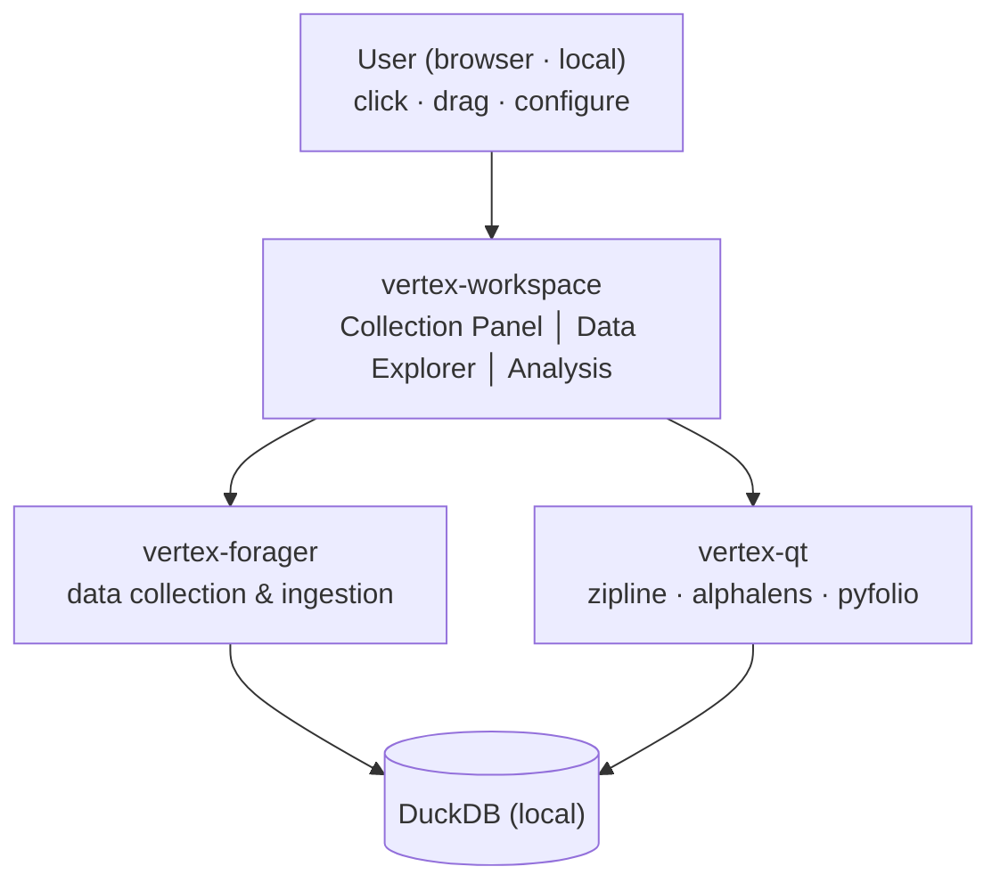

# VertexLab

[](https://github.com/coolbress/VertexLab/releases)
[](https://github.com/coolbress/VertexLab/actions/workflows/ci.yml)

[](https://github.com/coolbress/VertexLab/blob/main/LICENSE)

Collect large-scale financial data, run quantitative analysis, and manage everything from a unified local dashboard.

> Note: `vertex-forager` is the production-ready component today. `vertex-qt` and `vertex-workspace` are planned parts of the VertexLab experience, and their docs will expand as implementation work lands.

## Features

- Async data ingestion from Sharadar and yfinance with GCRA rate limiting and DLQ resilience
- Schema-aware normalization into local DuckDB with no cloud dependency
- Checkpoint-based resumable runs for large dataset collection
- Quantitative analysis and backtesting via `vertex-qt` with zipline, alphalens, and pyfolio
- Local Panel dashboard via `vertex-workspace` for collection control and visualization

## Installation

```bash
git clone https://github.com/coolbress/VertexLab.git vertex-lab
cd vertex-lab
uv sync --group dev
```

VertexLab is currently distributed through GitHub and repository-based workflows rather than PyPI. `pip install` is still possible when you use a GitHub source URL or release asset URL. See [Installation](installation.md) for the supported install paths.

## Quick Example

```python
# Full example coming soon — see Quickstart for current vertex-forager usage
```

## Preview

- Workspace screenshots and richer end-to-end output examples will be added here as `vertex-workspace` and `vertex-qt` become available.
- For the current concrete workflow, use the [Quickstart](quickstart.md) and the `vertex-forager` package docs.

## Components



| Package | Status | Purpose | Docs |
| --- | --- | --- | --- |
| `vertex-forager` | Available now | Efficiently collect large-scale financial data from multiple sources and build a local database on your machine with no cloud dependency required. | [Docs](https://coolbress.github.io/VertexLab/vertex-forager/) · [Releases](https://github.com/coolbress/VertexLab/releases) |
| `vertex-qt` | Planned | Develop and validate investment strategies using the collected data with backtests, factor analysis, and performance review. | More docs will be added as implementation work lands |
| `vertex-workspace` | Planned | Control collection, explore the database, run backtests, and visualize results from a local UI without writing code. | More docs will be added as implementation work lands |

## Support

- Python support: Python 3.10 and newer
- Release expectations: release artifacts are attached to GitHub Releases and changelog entries are maintained from the repository root
- Stability note: `vertex-forager` is available now; `vertex-qt` and `vertex-workspace` remain planned and will gain fuller docs as implementation work lands

## Links

- [Installation](installation.md)
- [Quickstart](quickstart.md)
- [Contributing](contributing.md)
- [Changelog](changelog.md)
