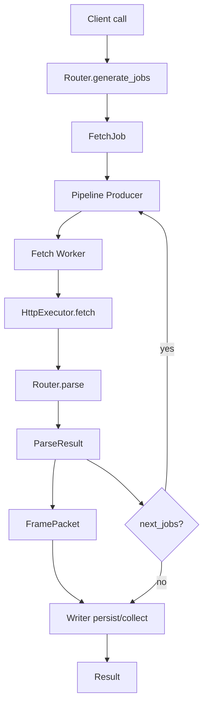
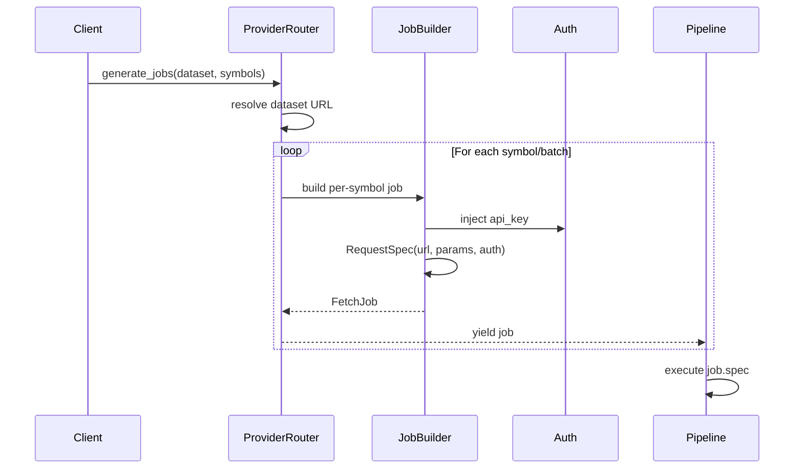

# How Built-in Providers Work

## Overview

`vertex-forager` is built for users who consume the built-in providers shipped by the package. Today that means provider-specific integrations such as yfinance and Sharadar can look very different internally, but they still flow through one shared collection model.

The goal of the provider architecture is simple:

- keep the user-facing client surface consistent
- isolate vendor-specific request and parsing logic
- normalize all provider outputs into one shared pipeline
- make it possible to add more built-in providers over time without rewriting the pipeline

## Current built-in providers

The package currently ships with these built-in providers:

- `yfinance`
  - library-backed provider for market data and related datasets exposed through the yfinance Python library
- `sharadar`
  - HTTP-backed provider for Nasdaq Data Link / Sharadar datasets

These two providers are useful examples of why the shared architecture exists: one relies on an internal library transport path, while the other uses normal HTTP requests, but both still enter the same normalization, persistence, metrics, result, and troubleshooting flow.

## Current built-in provider model

- Built-in providers share the same client-facing collection workflow
- Users do not need to implement custom providers to use the package effectively
- Provider internals are documented here to explain how built-in integrations work, not to present provider authoring as a primary workflow

This design also leaves room for future built-in providers to be added over time while preserving the same persistence, metrics, result, and troubleshooting model.

## Built for future built-in providers

`vertex-forager` is intentionally structured so more built-in providers can be added over time without forcing users to learn a new collection model for each vendor.

That means future built-in providers should still be able to share:

- the same `create_client(...)` entrypoint pattern
- the same request → normalize → collect/write pipeline
- the same result, metrics, persistence, and troubleshooting surface

This is an internal architecture goal for the package itself, not a statement that normal users are expected to build custom providers as part of the primary workflow.

## What users should expect

From a user point of view, the most important consequence of this design is consistency. Built-in providers may fetch data differently internally, but they should still feel like one package when you use them.

That means users should expect built-in providers to share:

- the same client creation pattern
- the same request style for normal collection methods
- the same in-memory vs persistence split
- the same metrics, quality-check, and troubleshooting vocabulary
- the same general result and write behavior once data enters the pipeline

## Why providers are split this way

- `Client`
  - exposes the user-facing collection methods and configuration surface
- `Router`
  - turns a dataset request into fetch jobs and parses raw payloads into normalized frames
- `Pipeline`
  - coordinates fetch, parse, normalize, quality checks, buffering, and write/collect behavior

This split keeps vendor-specific logic out of the shared pipeline while preserving a consistent API for built-in providers.

## HTTP-backed vs library-backed providers

- HTTP-backed providers such as Sharadar build normal `http` or `https` request specs
- Library-backed providers such as yfinance route calls through an internal library transport layer
- The transport choice is internal; users still work through the same client methods
- Once payloads are normalized into shared frame/table structures, downstream pipeline stages remain provider-agnostic

For a library-backed provider such as yfinance, the flow is:

1. a client method requests a dataset
2. the router emits a request spec with an internal scheme such as `yfinance://...`
3. the shared executor routes that spec to the registered library fetcher
4. the returned Python object is serialized across the fetch boundary
5. the router decodes and normalizes it into shared frames and tables

After that point, both library-backed and HTTP-backed providers follow the same downstream path for normalization, buffering, metrics, and write or collect behavior.

## Router responsibilities

Routers are responsible for:

- building fetch jobs for a dataset and symbol set
- defining provider-specific request parameters and pagination behavior
- parsing raw responses into `FramePacket` objects
- mapping provider-specific errors into shared project exceptions
- normalizing dataset and table naming so writes and in-memory collection stay consistent

## Shared pipeline surface

The provider split is an implementation detail that supports a consistent built-in user experience. This architecture is why built-in providers can share:

- one client creation flow
- one persistence model
- one metrics and result surface
- one set of how-to and troubleshooting guides

## Internal safety constraints

- provider-specific logic stays out of the shared HTTP executor
- private or dunder attribute access is blocked in the library-backed transport path
- request specs must describe an allowed call shape
- secrets should not appear in logs
- invalid transport specs surface as typed failures instead of silent fallbacks

## Internal modules

- routers/base.py
  - BaseRouter contract and responsibilities (`generate_jobs`, `parse`)
- routers/transforms.py
  - Common helpers for metadata injection, date parsing, empties, and column normalization
- routers/jobs.py
  - Standard job builders and pagination context helpers
- routers/errors.py
  - Provider-to-standard exception mapping
- clients/dispatcher.py
  - Pipeline orchestration function to isolate Client from pipeline specifics
- clients/validation.py
  - Reserved-key filtering for pipeline kwargs and shared client-side checks

## Reserved Pipeline Kwargs

- router
- dataset
- symbols
- writer
- mapper
- on_progress

These keys are explicitly passed into `pipeline.run` and should be removed from kwargs forwarding using `clients/validation.filter_reserved_kwargs`.

## Testing

- Unit tests cover transforms, jobs, errors, and validation modules to ensure stable contracts
- Full regression coverage confirms behavior parity across built-in providers

## Examples

- Error mapping
  - Quandl-style: `raise_quandl_error(provider="sharadar", err=err)` → `FetchError`
  - yfinance parse: `raise_yfinance_parse_error(exc=exc, dataset=dataset)` → `TransformError`; preserves `UnpicklingError`; maps `HTTPError` to `FetchError`
- Job policy
  - Single ticker: `single_symbol_job(provider=provider, dataset=dataset, symbol=symbol, url=url, params=params, auth=None, context={"symbol": symbol})`
  - Pagination: `pagination_job(provider=provider, dataset=dataset, url=url, params=params, auth=auth, context=make_pagination_context(meta_key=meta_key, cursor_param=cursor_param, max_pages=max_pages))`

## Diagrams

### Flowchart — Router → Pipeline

### Sequence — URL Build & Delivery

