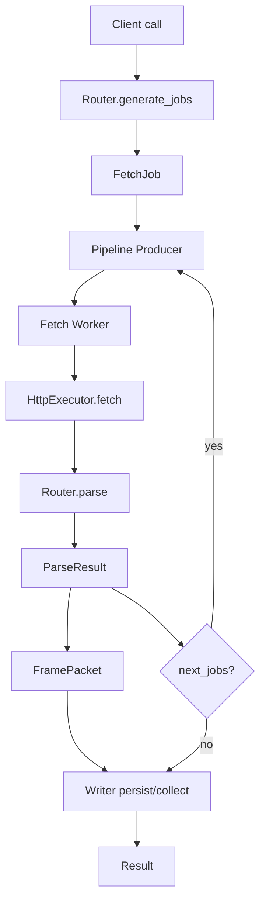
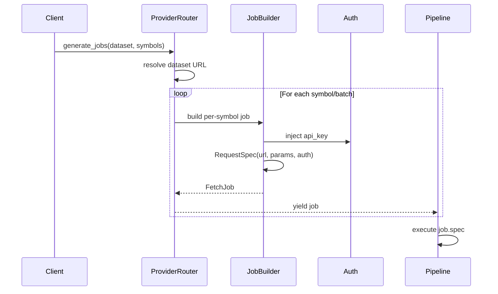

# Router & Client Architecture

## Overview

- Decomposes large “god classes” into cohesive submodules.
- Applies Dependency Inversion Principle (DIP): core depends on abstractions; providers implement them.
- Improves readability, testability, and maintainability for future providers.

## Modules

- routers/interfaces.py
  - BaseRouter contract and responsibilities (generate_jobs, parse).
- routers/transforms.py
  - Common helpers for metadata injection, date parsing, empties, column normalization.
- routers/jobs.py
  - Standard job builders (pagination_job, single_symbol_job) and pagination context factory.
- routers/errors.py
  - Provider-to-standard exception mapping (e.g., Quandl-style errors, yfinance parse).
- clients/dispatcher.py
  - Pipeline orchestration function to isolate Client from pipeline specifics.
- clients/validation.py
  - Reserved-key filtering for pipeline kwargs and shared client-side checks.

## Reserved Pipeline Kwargs

- router
- dataset
- symbols
- writer
- mapper
- on_progress

These keys are explicitly passed into pipeline.run and should be removed from any kwargs forwarding using clients/validation.filter_reserved_kwargs.

## Extensibility

- Providers should prefer routers/jobs.py for job construction and routers/errors.py for error mapping.
- Column normalization can be overridden per provider by implementing BaseRouter._normalize_columns.
- Pagination policies can be adjusted using make_pagination_context for cursor keys and max pages.

## Testing

- Unit tests cover transforms/jobs/errors/validation modules to ensure stable contracts.
- Full regression suite confirms behavior parity after decomposition.

## Examples

- Error Mapping
  - Quandl-style: raise_quandl_error(provider='sharadar', err=err) → FetchError
  - yfinance parse: raise_yfinance_parse_error(exc=exc, dataset=dataset) → TransformError; preserves UnpicklingError; HTTPError → FetchError
- Job Policy
  - Single ticker: single_symbol_job(provider=provider, dataset=dataset, symbol=symbol, url=url, params=params, auth=None, context={'symbol': symbol})
  - Pagination: pagination_job(provider=provider, dataset=dataset, url=url, params=params, auth=auth, context=make_pagination_context(meta_key=meta_key, cursor_param=cursor_param, max_pages=max_pages))

## Provider Integration Guide

- Implement Router that inherits BaseRouter and conforms to interfaces.generate_jobs/parse.

## Diagrams

### Flowchart — Router → Pipeline

### Sequence — URL Build & Delivery

